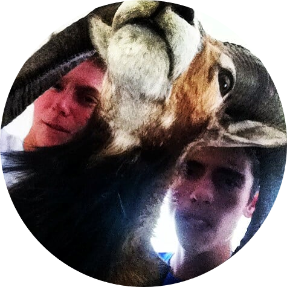

[3]:   "Adam" 
[4]:  https://www.youtube.com/watch?v=4nII6BugOss "Adam's Youtube"
[1]:  profiles/Mishell.jpg "Mishell"
[2]:  https://digitalcommons.humboldt.edu/ideafest_posters/288/ "Mishell's Poster"

#### Scroll this way for more TAs ➡️ ####

| Adam Grimmitt | Mishell Lopez | Jake Smith | MAYBE | 
|:-:|:-:|:-:|:-:|
| KINS 379 and 492 | KINS 386 and 492 | KINS 379 | KINS 386 |
||![Mishell's Image][1]|![Mishell's Image][1]|![Mishell's Image][1]|
|[click here for video introduction](https://www.youtube.com/watch?v=4nII6BugOss "Adam's Video")|[click here for video introduction](https://digitalcommons.humboldt.edu/ideafest_posters/288/ "mishell's poster")|[click here for video introduction](https://digitalcommons.humboldt.edu/ideafest_posters/288/ "mishell's poster")|[click here for video introduction](https://digitalcommons.humboldt.edu/ideafest_posters/288/ "mishell's poster")|
| abg40@humboldt.edu | ml157@humboldt.edu | jcs34@humboldt.edu | rs120@humboldt.edu |

_Hey there! Welcome! Please check us out!_

We wanted to make a page that was:
* Accesible to all students 
* Isolated from canvas in a way that was easily accessible
* Looked like it was made by a 4th grader 
** (Coded by Grad Students!! have some fun TRY!!) 
* Regularly updated enough...

## Click on the images below to access videos _(90 seconds)_ introducing each TA
  - Get some information on the courses they teach.
  - Learn a little about who they are. 

### _If you would like, feel free to send them a video letting them know who you are!_ 
